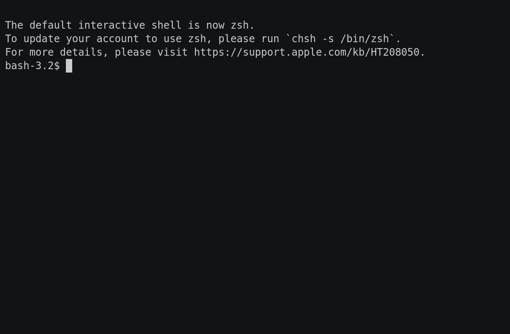

# Snake

This project is an implementation of Snake in Rust. Mostly a testbed for playing around with a few libraries in the Rust ecosystem.

[](https://asciinema.org/a/523037)

## Running

This is a binary Cargo crate. You can run it from a local clone of the repository by running:

```
cargo run
```

Use arrow keys for controlling the snake.

You can exit the game at any time by pressing 'q' or the Esc key.